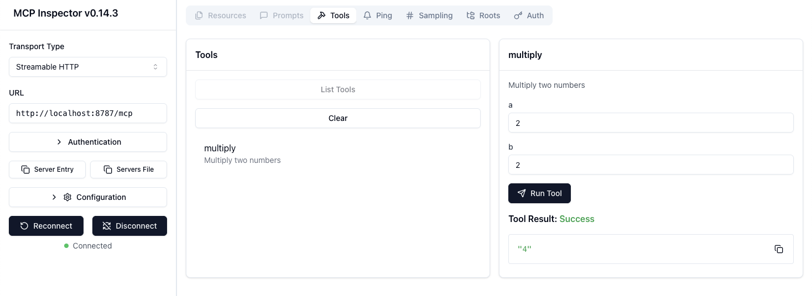

```txt
npm install
npm run dev
```

```txt
npm run deploy
```

[For generating/synchronizing types based on your Worker configuration run](https://developers.cloudflare.com/workers/wrangler/commands/#types):

```txt
npm run cf-typegen
```

Pass the `CloudflareBindings` as generics when instantiation `Hono`:

```ts
// src/index.ts
const app = new Hono<{ Bindings: CloudflareBindings }>()
```

## InspectorでMCPを確認する場合

Auth が未実装なので

```shell
DANGEROUSLY_OMIT_AUTH=true pnpx @modelcontextprotocol/inspector
```


で起動し、

- Transport Type: Streamable HTTP
- URL: http://localhost:8787/mcp

で実行できた。


